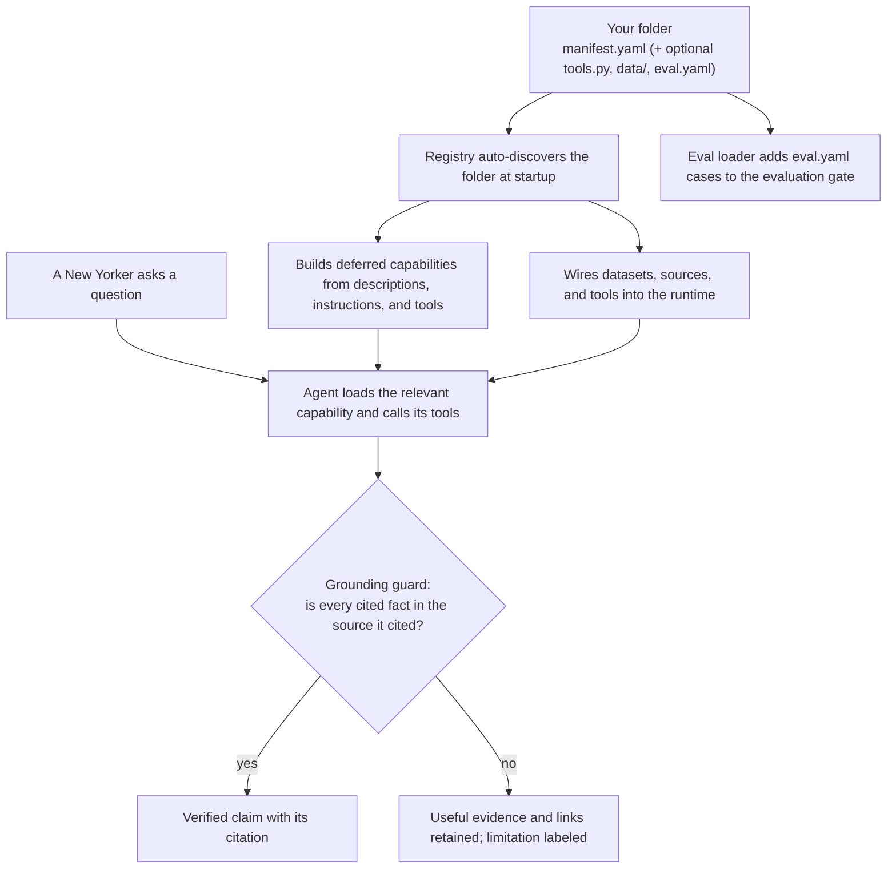

# Contributing to HeyNYC

HeyNYC is open source and grows through contributions that make NYC services easier to find and use.

There are several useful ways to help:

1. **Report a wrong or unhelpful answer:** use the [bug report template](.github/ISSUE_TEMPLATE/bug_report.yml), without including anyone's personal information.
2. **Propose a module:** open a [module request](#requesting-a-module).
3. **Improve a source mapping or eval:** correct how an existing module reads, labels, or tests its source.
4. **Add a module:** open a [pull request](#adding-a-module).
5. **Improve the core, channels, privacy, safety, or documentation:** describe the resident or contributor problem and keep the change focused.

---

## What a module is

A **module** packages one area of resident help with its sources, typed operations, instructions, limitations, and evals. HeyNYC keeps each module in one folder with a YAML manifest:

```
heynyc/modules/<name>/
  manifest.yaml     # required: declares the module (pure YAML)
  eval.yaml         # recommended: test questions
  tools.py          # optional: only for custom logic
  data/             # optional: curated data files
  topics/<topic>/   # optional: a submodule (reuses the parent's tool; own sources + eval)
```

This is HeyNYC's internal package boundary, not a claimed civic-data standard. At runtime, the package becomes a deferred agent capability; source adapters translate external systems inside it, while Agent Skills, MCP, OpenAPI, and data profiles serve different boundaries. The canonical definitions, standards, and reasons for those distinctions live in the [service-module terminology guide](heynyc/modules/README.md#terminology-what-each-layer-is-called).

**Shallow by default.** A module is a folder with the manifest at its root; the only nesting is an optional `data/` subfolder for curated data, or a `topics/<topic>/` subfolder for a **submodule**: a light sub-service that reuses the parent's tool and owns its own sources and evals (for example, `events/topics/world_cup/`).

The module manifest and examples live in the [modules README](heynyc/modules/README.md) and the existing module folders.

---

## How a module plugs in

The [registry](heynyc/core/registry.py) discovers direct module folders and one optional `topics/` level at startup. It supplies source bindings, tools, and capability instructions to the shared runtime. The [eval loader](heynyc/eval/cases.py) reads each package's eval cases separately. The [grounding boundary](heynyc/core/grounding.py) checks cited claims before delivery. If a claim cannot be verified, HeyNYC preserves useful retrieved material and source links while labeling the limitation rather than replacing the whole answer with generic fallback copy.



The shared runtime provides citation, verification, privacy, and evaluation machinery. Module authors still own accurate source mappings, typed constraints, honest limitations, and cases that prove the normal and failure paths.

---

## Requesting a module

No coding required. Open an issue using the **"Propose a new service module"** template and fill in:
- the service name and what it helps people do,
- the pages from the agency, organization, or data publisher responsible for it,
- a NYC Open Data dataset id if it is a "find nearest X" service (search the
  [NYC Open Data catalog](https://data.cityofnewyork.us)),
- 2-3 real questions a person would ask.

A maintainer or contributor can turn that into a module.

---

## Adding a module

```bash
# 1. Fork + clone, then run from the repository root
uv sync --extra dev

# 2. Scaffold the internal module package
uv run python -m heynyc new-module <name>

# 3. Edit heynyc/modules/<name>/manifest.yaml  (see heynyc/modules/README.md)
#    Add normal, missing-source-detail, and relevant inverse cases in eval.yaml.

# 4. Confirm it loads and offline tests pass
uv run python -m heynyc modules
uv run python -m pytest -q

# 5. Run the module's focused live eval with maintainer approval, then have
#    a fresh-context reviewer inspect the saved trace.
uv run python -m heynyc eval --module <name>

# 6. (If it indexes pages) rebuild + sanity-check
uv run python -m heynyc index-build
uv run python -m heynyc chat "a question your module should handle"
```

Open a PR using the template. Never present a location, distance, hour, eligibility rule, price, or deadline as verified unless a retrieved source supports it. When support is incomplete, keep the useful record and source link, identify the missing or conflicting detail, and never fill the gap from model memory.

### PR checklist
- [ ] One folder under `heynyc/modules/<name>/` with `manifest.yaml`.
- [ ] `examples` reflect how residents actually phrase the need.
- [ ] If using a dataset, `field_map` matches the dataset's actual columns.
- [ ] `prompt` names the relevant operation, source boundaries, and limitations.
- [ ] Typed inputs validate every resident or model supplied constraint.
- [ ] `eval.yaml` covers the normal path, a relevant source gap or provider failure, and the inverse of any deterministic response.
- [ ] `uv run python -m heynyc modules` lists it; `pytest` is green.
- [ ] The focused live eval passes and a fresh-context reviewer has inspected the saved trace.

---

## Code style
- Python, async, type-hinted. Keep tools small and well-described.
- Lint before you push: `uv run ruff check heynyc/ tests/ scripts/`. CI enforces it (pyflakes + import order; formatting is not enforced).
- Secrets only via `.env` (never committed). See `.env.example`.
- New behavior comes with tests (`tests/`), no network/LLM calls in unit tests.
