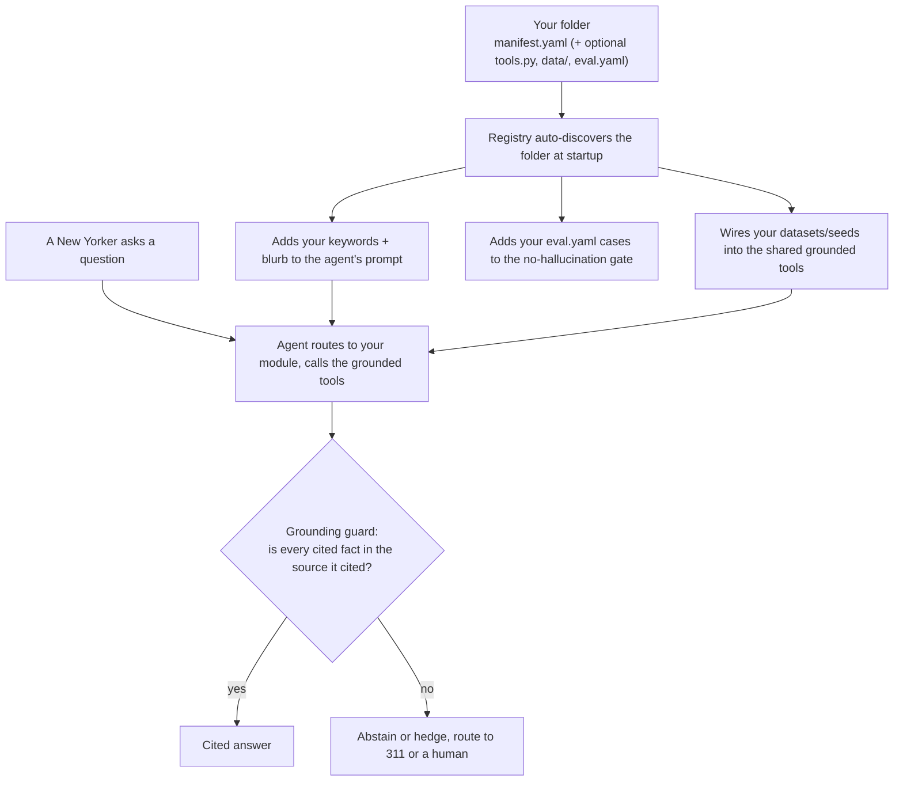

# Contributing to HeyNYC

HeyNYC is open source and grows through community-contributed service modules. If there's a gov't service that we haven't covered (DMV, Fair Fares, loans), we would appreciate any help with creating a well-grounded module for that service.

There are two ways to help:

1. **Request a module** (no code): open a [New service module issue](#requesting-a-module-issue).
2. **Add a module** (a little YAML): open a [pull request](#adding-a-module-pull-request).

---

## The module convention (and why it's shaped this way)

A module is **one folder with a YAML manifest** at its root:

```
heynyc/modules/<name>/
  manifest.yaml     # required: declares the module (pure YAML)
  eval.yaml         # recommended: test questions
  tools.py          # optional: only for custom logic
  data/             # optional: curated data files
  topics/<topic>/   # optional: a submodule (reuses the parent's tool; own sources + eval)
```

To not reinvent the wheel, we use the same **"one descriptor file per unit, in its own folder"** convention as [Backstage `catalog-info.yaml`](https://backstage.io/docs/features/software-catalog/descriptor-format/) and Helm's `Chart.yaml`: the manifest carries `name` + `description` + keywords for routing, and adding a unit means dropping in a folder: **convention over configuration**. (A HeyNYC module is a plain MCP-style tool + a schema-validated manifest; we deliberately do **not** use Anthropic Agent Skills, which are for reusable techniques, not project-specific data + config.)

**Shallow by default.** A module is a folder with the manifest at its root; the only nesting is an optional `data/` subfolder for curated data, or a `topics/<topic>/` subfolder for a **submodule**: a light sub-service that reuses the parent's tool and owns its own sources + eval (e.g. `events/topics/world_cup/`). Most modules are a single `manifest.yaml`.

The module manifest and examples live in the [modules README](heynyc/modules/README.md) and the existing module folders.

---

## How your module plugs in

You drop in a folder. The registry discovers it at startup and fans it out into the prompt, the shared grounded tools, and the test gate. At query time, factual claims your module returns pass through the grounding guard before a New Yorker sees them, so the "grounded or it abstains" contract applies no matter which module answered.



The upshot for you as an author: you never have to build the safety machinery. Point the manifest at a real dataset or official page, tell the agent when to abstain, and the shared tools + guard + eval gate carry the rest.

---

## Requesting a module (issue)

No coding required. Open an issue using the **"Propose a new service module"** template and fill in:
- the service name and what it helps people do,
- the official NYC page(s) for it,
- a NYC Open Data dataset id if it's a "find nearest X" service (search
  <https://data.cityofnewyork.us>),
- 2-3 real questions a person would ask.

A maintainer (or you!) can turn that into a module.

---

## Adding a module (pull request)

```bash
# 1. Fork + clone, then run from the repository root
uv sync --extra dev

# 2. Scaffold a module
uv run python -m heynyc new-module <name>

# 3. Edit heynyc/modules/<name>/manifest.yaml  (see heynyc/modules/README.md)
#    Add a few eval cases in eval.yaml, include at least one `abstain: true` case.

# 4. Confirm it loads and tests pass
uv run python -m heynyc modules
uv run python -m pytest -q

# 5. (If it indexes pages) rebuild + sanity-check
uv run python -m heynyc index-build
uv run python -m heynyc chat "a question your module should handle"
```

Open a PR using the template. Keep modules **grounded**: never return a fact (location, distance, hours, eligibility, price) that didn't come from a tool/dataset. When in doubt, the module's `prompt` should tell the agent to **abstain and link to the official page**.

### PR checklist
- [ ] One folder under `heynyc/modules/<name>/` with `manifest.yaml`.
- [ ] `keywords` reflect how real people phrase it.
- [ ] If using a dataset, `field_map` matches the dataset's actual columns.
- [ ] `prompt` says which tool to use, to cite sources, and **when to abstain**.
- [ ] `eval.yaml` has ≥1 grounded case and ≥1 `abstain: true` case.
- [ ] `uv run python -m heynyc modules` lists it; `pytest` is green.

---

## Code style
- Python, async, type-hinted. Keep tools small and well-described.
- Lint before you push: `uv run ruff check heynyc/ tests/ scripts/`. CI enforces it (pyflakes + import order; formatting is not enforced).
- Secrets only via `.env` (never committed). See `.env.example`.
- New behavior comes with tests (`tests/`), no network/LLM calls in unit tests.
