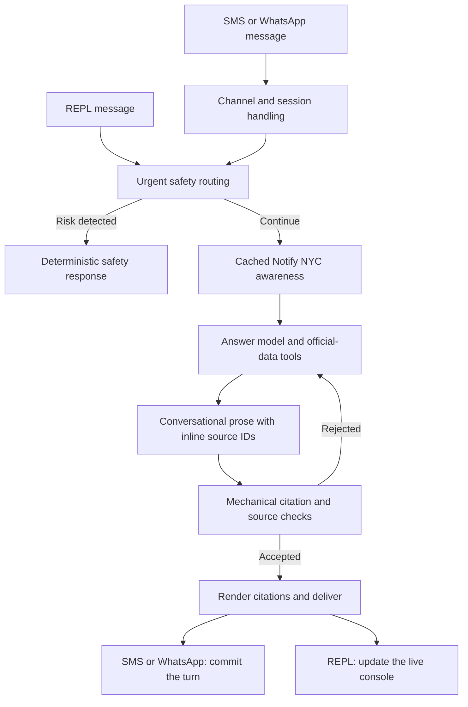

# HeyNYC

[](https://github.com/shayantist/HeyNYC/actions/workflows/ci.yml)
[](LICENSE)

**HeyNYC is an open interoperability and usability layer for NYC public services. It connects fragmented city and agency data, normalizes it into predictable, source-traceable records, applies deterministic location and time logic, and makes it accessible through SMS, WhatsApp, and compatible agents. The chatbot is one interface to that layer.** ([service modules](heynyc/modules/README.md), [typed tool boundary](heynyc/core/tools/base.py), [location and time example](heynyc/modules/cooling_centers/tools.py), [channels](heynyc/channels/README.md))

Text HeyNYC about life in New York: your commute on a flood-watch morning, this weekend's free events, a SNAP application, or an eviction notice. It uses public-service sources, cites factual claims so you can check them, and says when the available evidence cannot answer the question ([safety boundary](SAFETY.md)).

> Open-source civic project. Not affiliated with the City of New York.

Licensed under [AGPL-3.0-only](LICENSE). Git revisions through
[`15d20c4`](https://github.com/shayantist/HeyNYC/commit/15d20c4e25d00e330c3f23ae4f2e34792dc8293c)
retain the licenses attached to each revision. In particular, `15d20c4` remains available under
[Apache-2.0](https://www.apache.org/licenses/LICENSE-2.0); its existing license grant is unchanged.
Operators running a modified network version must offer its corresponding source and set
`HEYNYC_SOURCE_URL` to that location, as required by
[AGPL section 13](https://www.gnu.org/licenses/agpl-3.0.html#section13).

## Try it

The pilot is live at **1-888-212-0042** (toll-free):

- **WhatsApp:** [wa.me/18882120042](https://wa.me/18882120042)
- **SMS:** text **1-888-212-0042**

Free, no account, no app; standard carrier messaging rates apply. How your messages are handled: [PRIVACY.md](PRIVACY.md) · [Terms of Use](docs/legal/HEYNYC-TERMS.md).

<!-- TODO: screenshot of one real SMS exchange goes here -->

## What you can ask

The table below is the full, generated list of current service modules, each with the official source that grounds it.

<!-- CAPABILITIES:START -->

| Service | What you can ask | Grounded in | Official link |
| --- | --- | --- | --- |
| **Emergency advisories** | "Are there any advisories right now?"<br>"Is it safe to be outside today?" | Notify NYC / NYC Emergency Management feed | [nyc.gov](https://www.nyc.gov/notifynyc) |
| **Benefits & programs** | "I'm struggling to afford groceries, what can I get?"<br>"Am I eligible for SNAP?" | NYC Benefits & Programs dataset + Screening API | [access.nyc.gov](https://access.nyc.gov) |
| **Child care** | "Where's the nearest day care?"<br>"I need child care for my 2-year-old near Fordham, the Bronx" | NYC Open Data (gy3q-4tzp) | [nyc.gov](https://www.nyc.gov/site/doh/services/child-care.page) |
| **Clinics** | "Where can I see a doctor without insurance?"<br>"Free clinic near me" | HRSA Primary Health Care service-delivery sites | [access.nyc.gov](https://access.nyc.gov/programs/nyc-care/) |
| **Cooling centers** | "Where's the nearest cooling center?"<br>"It's too hot, where can I cool off indoors today?" | NYC Emergency Management - Cool Options | [finder.nyc.gov](https://finder.nyc.gov/coolingcenters/) |
| **Drinking fountains** | "Where is the nearest drinking fountain?"<br>"Where can I refill my water bottle near Rockefeller Center?" | NYC Parks Drinking Fountains | [data.cityofnewyork.us](https://data.cityofnewyork.us/Recreation/NYC-Parks-Drinking-Fountains-Map/622h-mkfu) |
| **Events** | "What's happening in NYC this weekend?"<br>"Any free events tonight?" | Ticketmaster + NYC Parks + NYC permitted street events | [nyctourism.com](https://www.nyctourism.com/events/) |
| **Food pantries** | "Where's the nearest food pantry?"<br>"I need free food today near me" | NYC FoodHelp finder | [finder.nyc.gov](https://finder.nyc.gov/foodhelp/) |
| **Housing & eviction help** | "I got an eviction notice, where can I get help near me?"<br>"My landlord won't turn on the heat, what do I do?" | NYC DSS/DHS - Homebase (eviction prevention) offices | [access.nyc.gov](https://access.nyc.gov) |
| **Housing Connect** | "What affordable housing lotteries are open right now?"<br>"How do I apply for an apartment through the housing lottery?" | NYC Open Data (vy5i-a666) | [housingconnect.nyc.gov](https://housingconnect.nyc.gov) |
| **Immigration** | "Did the Supreme Court decision end TPS for Haitians?"<br>"Where can I get a free immigration lawyer in NYC?" | Official NYC sources | [nyc.gov](https://www.nyc.gov/site/immigrants/legal-resources/legal-resources.page) |
| **Libraries** | "Is a library near me open late, and can I print homework there?" | Official NYC sources | [bklynlibrary.org](https://bklynlibrary.org) |
| **311 service requests** | "Is my 311 complaint moving? My service request number is 69741503"<br>"What's happening with 311 noise complaints near Union Square?" | NYC Open Data (erm2-nwe9) | [data.cityofnewyork.us](https://data.cityofnewyork.us) |
| **Public restrooms** | "Where is the nearest public restroom?"<br>"Is there a public bathroom near Union Square?" | NYC Open Data (i7jb-7jku) | [data.cityofnewyork.us](https://data.cityofnewyork.us) |
| **SNAP centers** | "Where's the nearest SNAP center?"<br>"Where do I apply for food stamps in person?" | NYC Open Data (tc6u-8rnp) | [nyc.gov](https://www.nyc.gov/site/hra/help/snap-benefits-food-program.page) |
| **Street closures** | "Are any streets closed near Yankee Stadium this Saturday?"<br>"Is there construction closing streets near Union Square right now?" | NYC Open Data (i6b5-j7bu) | [nyc.gov](https://www.nyc.gov/html/dot/html/motorist/weektraf.shtml) |
| **Transit** | "How do I get there by subway with a wheelchair?"<br>"Are the elevators working at my station?" | Official NYC sources | [mta.info](https://www.mta.info/accessibility) |
| **WIC** | "Where's the nearest WIC office?"<br>"I'm pregnant and need WIC near Jackson Heights, Queens" | NY State WIC directory (Health Data NY) | [health.ny.gov](https://www.health.ny.gov/prevention/nutrition/wic/) |
| **Worker rights** | "My boss is keeping our tips, is that legal?"<br>"The restaurant I work at takes a cut of our tips, can they do that?" | NY Labor Law + NYC DCWP | [dol.ny.gov](https://dol.ny.gov) |

<!-- CAPABILITIES:END -->

## What the layer adds

The [sources behind those questions](heynyc/modules/README.md) do not use one shared shape. HeyNYC gives the agent a more predictable contract while preserving what each source actually said:

- A FoodHelp ArcGIS row becomes a typed organization, service, location, schedule, phone, and service-at-location result, with the source query, source date, and citation retained beside it ([FoodHelp adapter](heynyc/modules/food_pantries/tools.py)).
- A cooling-center request is filtered by the resident's requested date and optional local time, then Python computes schedule status and distance instead of asking the language model to do date, clock, or distance arithmetic ([cooling-center adapter](heynyc/modules/cooling_centers/tools.py)).
- Missing source fields stay missing. A successful empty result, a partial provider response, and a provider failure remain different states in migrated typed tools, so the answer can describe the real limitation instead of filling the gap ([typed tool contract](heynyc/core/tools/base.py), [module conventions](heynyc/modules/README.md)).

## What makes it different

- **Verify or label:** Verified factual claims carry citations. When a complete answer cannot be verified, HeyNYC preserves useful retrieved material, marks the limitation, and provides the source links for you to check. Mechanical checks validate citation IDs and exact structured values, while live evaluations review broader claim support. See [SAFETY.md](SAFETY.md).
- **Does, not just tells:** It uses the city's benefits screener and can prepare the real application for review, without deciding eligibility itself.
- **Reachable today:** SMS, WhatsApp, and a CLI, without a resident account. Self-hosted instances need provider configuration for the messaging channels.
- **Open and self-hostable:** The package can be run by an operator who controls its infrastructure and model configuration.

## Current status

HeyNYC is an alpha release. The public pilot number above runs from an operator-managed server; a durable hosted deployment is still ahead.

- **Built:** a Python CLI, SMS and WhatsApp adapters, grounded service modules, scoped official-source web search as a retrieval tool, a deterministic citation guard, and an offline evaluation suite.
- **Agent runtime:** PydanticAI is the default. Operators can retain or restore the prior loop with [`HEYNYC_AGENT_RUNTIME=legacy`](heynyc/core/config.py); both runtimes use the same civic tools, grounding policy, encrypted resident transcript and channel store, and channel adapters.
- **Prototype, off by default:** the optional benefits application-form draft workflow and translate-at-edge pipeline. The model-based faithfulness checker remains available for evaluation comparisons but is not part of resident traffic. Forms require explicit configuration and encryption settings.
- **Conversation continuity:** messaging sessions resume from encrypted local transcripts and expire after the configured inactivity period. Twilio requests enter an encrypted SQLite inbox before acknowledgement; generated replies are durably staged before their turns commit, and delivery resumes from the last provider-accepted part after a restart. Resident-answer context is measured before it reaches the answer model, older turns compact only under pressure, and `NEW` starts fresh model context. Texting `DELETE MY DATA` and confirming erases the resident's transcript, queued messages, draft, and pending report flags; see the [privacy notice](docs/legal/HEYNYC-PRIVACY.md) and [safety guide](SAFETY.md).
- **Not yet shipped:** a resident web UI, durable Meta webhook intake, automated restore-tested host migration, self-service resident data export, authenticated browser actions, automatic application submission, and demonstrated production multilingual safety.
- **Known limitations:** intersection geocoding can be wrong, so HeyNYC echoes the resolved address and asks for confirmation. Some city datasets are thin (the SNAP-center list has weekday hours but no phone numbers), and HeyNYC says so rather than filling the gap.
- **Standardization still in progress:** FoodHelp, WIC, child care, and clinic tools have typed source-specific results, but HeyNYC does not yet publish one shared, schema-validated Open Referral profile or a standalone public interoperability API. "Compatible agents" currently means the configured HeyNYC agent can call the typed tool schemas; it does not mean a public MCP server is shipped ([FoodHelp adapter](heynyc/modules/food_pantries/tools.py), [WIC adapter](heynyc/modules/wic/tools.py), [child-care adapter](heynyc/modules/childcare/tools.py), [clinic adapter](heynyc/modules/clinics/tools.py), [agent tool adapter](heynyc/core/pydantic_runtime/tools.py), [Open Referral conformance rules](https://docs.openreferral.org/en/latest/hsds/conformance.html)).

## Using it

**As a resident (SMS or WhatsApp):** text the pilot number above, or the number your operator shares if someone else runs an instance. Ask in plain language, any language. Your first message gets a one-time note naming the built-in commands, which work in any chat, always free of model calls:

| Text | What happens |
| --- | --- |
| `HELP` | what HeyNYC can do |
| `PRIVACY` | how your info is handled, in short |
| `REPORT` (or 👎) | flag the last answer for human review, after you confirm |
| `DELETE MY DATA` | erase your conversation, queued messages, draft, and pending flags, after you confirm |
| `NEW` | start a fresh conversation the assistant no longer sees |
| `STOP` / `START` | SMS opt-out and opt-in (carrier-level) |

**As an operator or developer (CLI):** every command reads `.env` for models and keys; `--model` overrides explicitly where offered.

| Command | What it does |
| --- | --- |
| `heynyc repl` | interactive chat on the SAME path texters use: commands, sessions, caps all live. `--user <name>` keys a separate identity, `--temp` is a throwaway session that persists nothing, `--raw` is the bare-agent debug view |
| `heynyc chat "..."` | one-shot question |
| `heynyc serve` | the SMS/WhatsApp webhook server (see the [channels guide](heynyc/channels/README.md); the pilot launcher is `scripts/serve_demo.sh`) |
| `heynyc eval` | the no-hallucination gate. `--list` shows every case with tags, `--tag` / `--module` / `--case` select slices, `--sample N --seed K` rotates, bare runs need `--all` (cost guard) |
| `heynyc feedback` | resident-flagged exchanges, decrypted locally for triage |
| `heynyc stats` | turns, outcomes, costs, cache rates from local telemetry |
| `heynyc bench --models a,b` | run the case set across candidate models |
| `heynyc modules` / `new-module` | list or scaffold service modules |
| `heynyc index-build` / `index-search` | build or probe the retrieval index |
| `heynyc capabilities --write-readme` | regenerate the capability table below |

## Quickstart

```bash
# Run these commands from the repository root
uv sync --extra dev
cp .env.example .env        # add an LLM key; others are optional
uv run python -m heynyc index-build      # build the RAG index from module seeds
uv run python -m heynyc repl             # interactive, streaming chat
```

Scoped web search is a retrieval tool, not a resident-facing web channel. For SMS or WhatsApp, configure `HEYNYC_PII_SALT` and `HEYNYC_PII_KEY`, then run `uv run python -m heynyc serve`; see the [channels guide](heynyc/channels/README.md).

## How it works



The default Pydantic runtime follows this path:

1. For SMS and WhatsApp, the channel layer normalizes the message, deduplicates provider retries, restores the resident's encrypted session, and keeps that resident's turns in order while other residents can run concurrently. The REPL enters the agent directly and does not use channel persistence ([channel orchestrator](heynyc/channels/orchestrator.py), [REPL](heynyc/__main__.py)).
2. The current safety gate routes clear time-critical cases before the general tool loop. Narrow deterministic backstops cover chest pain, overdose or unsafe medication dosing, and high-confidence self-harm signals. The default Pydantic runtime adds multilingual self-harm classification and message-language detection; the retained legacy runtime uses only the deterministic backstops ([risk screen](heynyc/core/pydantic_runtime/safety.py), [runtime boundary](heynyc/core/pydantic_runtime/runtime.py), [deterministic backstops](heynyc/core/agent.py)).
3. A rolling seven-day process cache stores exact Notify NYC messages. Normal turns receive the newest exact messages that fit the bounded awareness prompt, with an omission count when more remain cached. A failed refresh keeps unexpired messages and labels them stale. Only this proactive awareness preflight uses the cache; an explicit `check_notify_nyc` request still fetches fresh, citable data ([advisory awareness](heynyc/modules/advisories/tools.py)).
4. The answer model sees one live `web_search`, one local `web_fetch`, and a deferred catalog of service operations. Search accepts optional `published_after` and `published_before` dates for open-ended or bounded publication-time searches. These are not event-date filters. Fetch handles one public URL through SSRF-protected HTTP or a Brave-rendered fallback, while source trust is graded separately from acquisition. Broad event discovery runs its required structured catalogs and one bounded current-web lane concurrently, so the model does not need to rediscover that invariant workflow ([search implementation](heynyc/core/tools/web_search.py), [event discovery](heynyc/modules/events/tools.py), [module conventions](heynyc/modules/README.md)).
5. The answer model writes ordinary conversational prose and places inline `{cite:S#}` markers immediately after supported claims. High-stakes guidance uses typed claim blocks with explicit citation IDs; the runtime renders those blocks back into the same resident-facing prose. Clarification and inherently unknowable outcomes also remain typed outputs ([runtime output contract](heynyc/core/pydantic_runtime/runtime.py)).
6. Mechanical checks reject unknown citation IDs, internal markup, discovery-only citations, and exact address, date, money, phone, or unit-number mismatches against structured DATA snapshots. An unverified search excerpt may support only its directly stated claim when the loaded capability is explicitly low-stakes; it stays labeled unverified. High-stakes web claims require authoritative evidence. A failed output gets up to two bounded complete-answer retries and never triggers paragraph pruning. Broader semantic citation correctness is measured in trace-backed evaluations rather than a second model call on every resident turn ([search trust grading](heynyc/core/tools/web_search.py), [grounding guard](heynyc/core/grounding.py), [runtime validator](heynyc/core/pydantic_runtime/runtime.py), [safety boundaries](SAFETY.md)).
7. Only the accepted answer is rendered. SMS and WhatsApp commit the persistent turn through the channel delivery flow; the REPL updates its live console directly ([session persistence](heynyc/core/session.py), [REPL streaming](heynyc/__main__.py)).

## Repo layout

```text
.
├── heynyc/              Python package and CLI
│   ├── core/            Agent loop, grounding, citations, RAG, and shared tools
│   ├── modules/         Service modules, their manifests, data, and evals
│   ├── eval/            The live evaluation harness: runs the real model and tools against each module's eval.yaml contract and grades resident outcomes; inside the package because `heynyc eval` and `bench` are product commands
│   └── channels/        SMS and WhatsApp adapters
├── docs/                Public docs
│   ├── testing/         Generated public test records (failure register, red-team, benchmarks)
│   ├── legal/           Formal Privacy Notice and Terms of Use
│   └── internal/        Local-only specs, plans, and dev notes (gitignored, not shipped)
├── tests/               Offline pytest suite: deterministic, mocked, free; proves code contracts. Root by Python convention, never shipped
├── scripts/             Development and demo scripts
└── .github/             Issue and pull-request templates
```

Offline tests prove contracts; live evals prove behavior.

## Docs map

| Doc | What it covers |
| --- | --- |
| [SAFETY.md](SAFETY.md) | How the AI stays grounded and safe: guardrails, red-team results, abstention, and data freshness. |
| [SECURITY.md](SECURITY.md) | How to report a security vulnerability through the private disclosure policy. |
| [PRIVACY.md](PRIVACY.md) | Plain-language: what happens to your messages. The formal [Privacy Notice](docs/legal/HEYNYC-PRIVACY.md) controls. |
| [Terms of Use](docs/legal/HEYNYC-TERMS.md) | Pilot limitations, messaging terms, and user responsibilities. |
| [CONTRIBUTING.md](CONTRIBUTING.md) | How to add a module or contribute. |
| [CHANGELOG.md](CHANGELOG.md) | The running day-to-day log of what shipped. |
| [CODE_OF_CONDUCT.md](CODE_OF_CONDUCT.md) | The community standards for taking part. |
| [LICENSE](LICENSE) | The open-source license the project ships under. |
| [`docs/testing/`](docs/testing/) | HeyNYC's public test records; the eval harness that produces the gate results lives in [`heynyc/eval/`](heynyc/eval/README.md). Covers the [failure register](docs/testing/failure-db.md), the [red-team write-up](docs/testing/red-team.md), and the [benchmark methodology](docs/testing/benchmarks.md). |
| [heynyc/eval/README.md](heynyc/eval/README.md) | The evaluation harness: cases, gates, rubric, and how to run it. |
| [heynyc/channels/README.md](heynyc/channels/README.md) | SMS and WhatsApp adapter conventions. |
| [heynyc/modules/README.md](heynyc/modules/README.md) | Service-module structure and how to scaffold one. |

## FAQ

### If you're texting it

**How do I know it isn't making things up?** HeyNYC distinguishes verified claims from material it could not confirm. Before delivery, mechanical checks catch unknown citations and exact structured values that disagree with their cited records. If correction retries run out, the resident sees the supported parts, the unresolved limitation, and the relevant source links instead of a generic failure message. Trace-backed live evaluations review the broader claim-to-source relationship that code cannot establish from arbitrary prose alone. It also never decides your eligibility and never submits anything on your behalf; the full design is in [SAFETY.md](SAFETY.md).

**Do people read my messages?** No one reads your conversations in the normal course of things; a human sees an exchange only if you send it to us with REPORT and confirm, or if a safety or abuse review requires it. The plain-language version is [PRIVACY.md](PRIVACY.md); the formal [Privacy Notice](docs/legal/HEYNYC-PRIVACY.md) controls.

**How do I delete my data?** Text DELETE MY DATA and confirm: your encrypted transcript, queued messages, any in-progress draft, and pending flags are erased, and only PII-free aggregate statistics and anonymized abuse-control spend remain. What's kept and for how long is in [PRIVACY.md](PRIVACY.md).

**Can I get a copy of my conversations?** Not through an automated command yet. You can request a copy of information held directly by Reach4Help at [privacy@reach4help.org](mailto:privacy@reach4help.org); the planned self-service export and its machine-readable format are described in [PRIVACY.md](PRIVACY.md).

**Is it free?** Yes. Standard messaging rates from your carrier apply, nothing from us.

**What languages?** Write in whatever language you're comfortable in: Spanish, Bengali, Chinese, Urdu, and more; program names, addresses, and links stay exact because the official pages are in English. Non-English safety has dedicated tests but isn't yet proven at production grade, which [SAFETY.md](SAFETY.md#limitations-what-we-havent-proven-yet) states plainly.

**Why not just ask ChatGPT?** A general chatbot is built to always have an answer; HeyNYC is built to be right or say it doesn't know, which is the property that matters when the question is your housing, your food, or your immigration status. It also reaches for what a general chatbot doesn't have: live city datasets, the city's real benefits screener, a citation on every fact, and a benchmark that runs its cases head-to-head against a bare frontier model ([methodology](docs/testing/benchmarks.md)).

**Something was wrong or unhelpful. What do I do?** Text REPORT (or just 👎) after the bad answer. You'll be asked to confirm before that one exchange is shared with a human reviewer.

### If you're evaluating it (the City, journalists, civic technologists)

**How is this not another MyCity chatbot?** MyCity answered confidently without grounding and [told business owners they could break the law](https://themarkup.org/artificial-intelligence/2024/03/29/nycs-ai-chatbot-tells-businesses-to-break-the-law). HeyNYC pairs source labeling with mechanical citation checks, live trace review, and permanent regressions for MyCity's documented failures ([the traps and the real law behind each](docs/testing/benchmarks.md)). We also publish our own failures as a numbered [register](docs/testing/failure-db.md); [SAFETY.md](SAFETY.md) explains the remaining boundary.

**What grounds the answers?** NYC Open Data, the city's Benefits Screening API, official finders, and live web retrieval with explicit source-trust grades. High-stakes claims require authoritative evidence from a sufficient direct excerpt or fetched page. An explicitly low-stakes capability may cite the exact claim stated by an unverified search excerpt, with the source still identified as unverified. The capability table above names the dataset behind each module; the source-trust design is in [SAFETY.md](SAFETY.md).

**Is HeyNYC building another master database of services?** No. A service adapter reads the responsible live source or a bounded, dated source snapshot or catalog, adapts the returned record for the current request, keeps its citation and source metadata, and gives that result to the agent. HeyNYC separately stores encrypted conversation state and uses bounded local indexes where semantic retrieval is useful, such as the benefits catalog; those are not a replacement system of record for City services ([tool adapters](heynyc/modules/README.md), [clinic catalog example](heynyc/modules/clinics/tools.py), [conversation state](heynyc/core/pydantic_runtime/runtime.py), [retrieval index](heynyc/core/index/)).

**Which AI models, and who processes resident data?** The answer model is operator-configured through Pydantic AI. Mechanical citation checks are provider-independent, while answer quality still depends on the selected model and must pass live evaluations before exposure. Messages are carried by Twilio or Meta, and every service provider is named in the formal [Privacy Notice](docs/legal/HEYNYC-PRIVACY.md). Self-hosted models remain an explicit design goal ([SAFETY.md](SAFETY.md)).

**How is it tested?** An offline pytest suite proves the code's contracts, and a live eval gate runs the real model against every module's contract with a deterministic no-hallucination floor; red-team results and failures become permanent public records. Start at [heynyc/eval/README.md](heynyc/eval/README.md) and [`docs/testing/`](docs/testing/).

**What's the language-access story?** NYC Local Law 30's citywide languages are the bar we build toward, and the assistant replies in the resident's language with dedicated non-English safety cases. We claim testing, not certification; the honest state is in [SAFETY.md](SAFETY.md#limitations-what-we-havent-proven-yet).

**Can we request or add a service module?** Yes: a module is one folder with a YAML manifest, and requesting one needs no code at all. [CONTRIBUTING.md](CONTRIBUTING.md) has both paths.

**What would this cost a city?** Built-in telemetry records model, tool, latency, and cost usage for each evaluated turn. The configured resident path avoids a second model call solely for semantic verification, so deployments can compare hosted and self-hosted models against the same live evaluation gate ([SAFETY.md](SAFETY.md)).

_Last updated: 2026-08-16_
